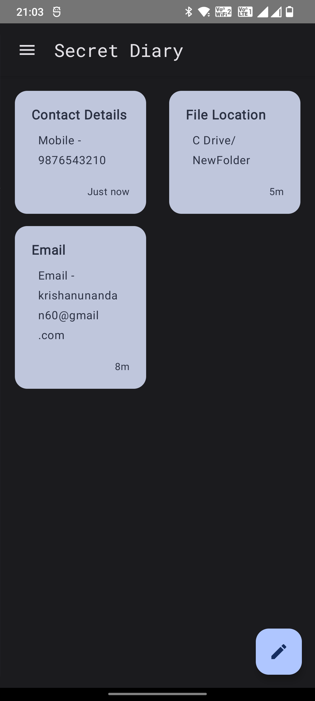
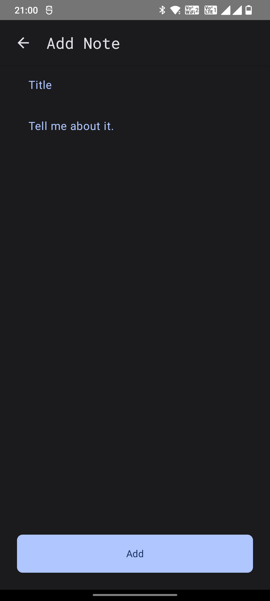
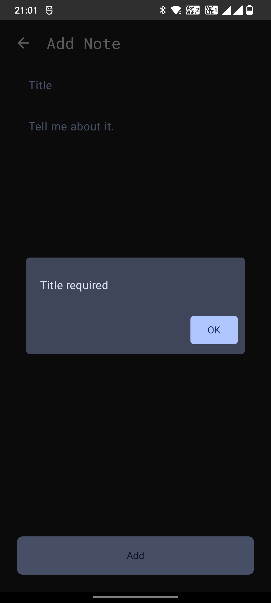
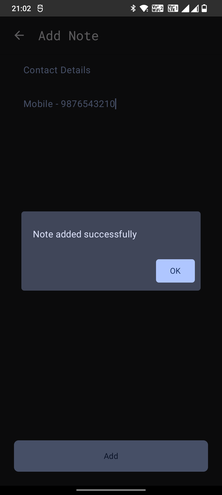
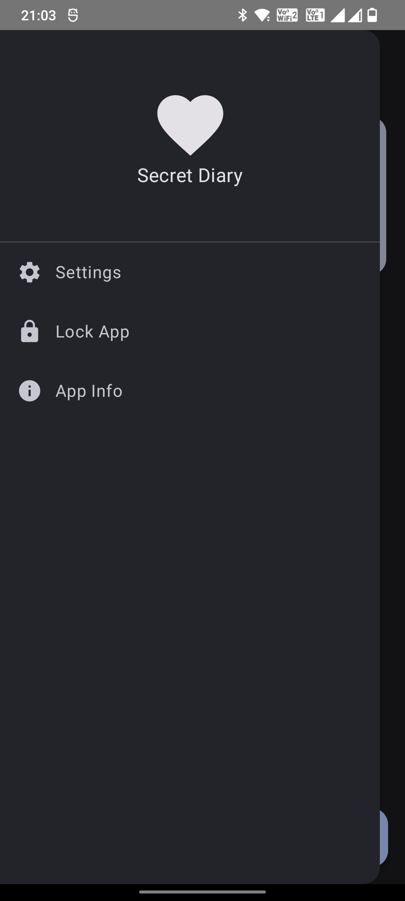
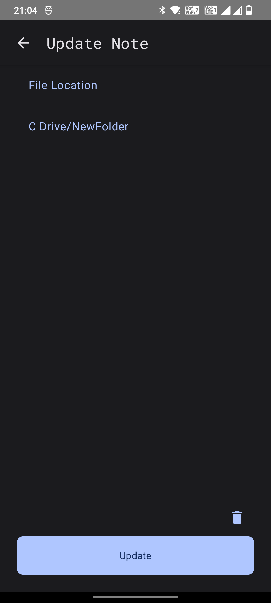

# 📔 SecretDiary

**SecretDiary** is a modern, minimalist note-taking app built with **Jetpack Compose** and **Room Database**, designed for privacy and simplicity. It allows users to **add**, **update**, and **delete notes** with an intuitive interface — all stored locally on the device.

---

## ✨ Features

✅ Current Features (Phase 1):
- 📝 Add new notes  
- 🛠️ Update existing notes  
- ❌ Delete notes  
- ⚡ Built using Jetpack Compose for a modern UI  
- 🗃️ Uses Room Database for local persistence
-   Theming options (Dark & Light Mode)

🚧 Coming Soon (Phase 2):
- 🔐 App Lock with Fingerprint or PIN  
- ☁️ Data sync with Google Drive  

---

## 🛠 Tech Stack

| Tool             | Purpose                      |
|------------------|-------------------------------|
| Jetpack Compose  | Declarative UI Framework      |
| Room Database    | Local data persistence        |
| Kotlin           | Programming Language          |
| MVVM             | Architecture Pattern          |

---

## 📷 Screenshots

<!-- Add your screenshot image(s) here. Example: -->
<p align="center">
  
  
  
</p>

<p align="center">
  
  
  
</p>


*More screenshots can be added in a `screenshots/` folder.*

---

## 🚀 Getting Started

To run the project locally:

1. **Clone the repository:**
   ```bash
   git clone https://github.com/yourusername/SecretDiary.git
   cd SecretDiary

🔒 Privacy Focused
Your notes are stored only on your device. With the upcoming SecurityLock feature, you can keep your notes even more secure.

📅 Roadmap
 Core note management (CRUD) - Done

 Biometric or PIN-based App Lock

 Google Drive data sync
